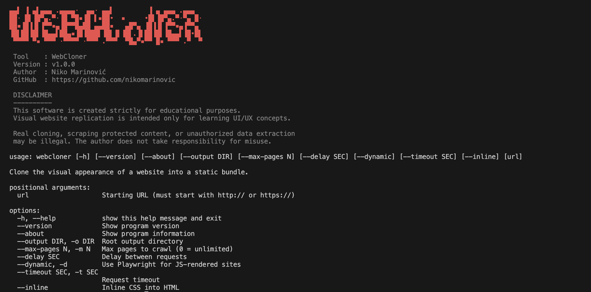

<h1 align="center">
  
  <br />
  WebCloner
</h1>

<p align="center">
  Clone entire public websites into fully browsable offline static copies — including all pages, assets, and navigation.
</p>

---

## What is WebCloner?

**WebCloner is a full‑site replication tool designed for educational analysis and offline browsing:**

- Crawls **all internal pages** automatically  
- Downloads HTML, CSS, images, fonts, and JavaScript  
- Rebuilds complete website structure locally  
- Rewrites navigation for fully offline browsing  
- Supports dynamic JavaScript websites (React / Vue / Angular)

**`A complete static mirror of any publicly accessible website.`**

---

## How It Works

Getting started with WebCloner is fast:

1. **Crawl Website** — Discovers and queues all internal pages  
2. **Fetch Content** — Downloads HTML using requests or Playwright  
3. **Extract Resources** — Collects CSS, assets, fonts, and scripts  
4. **Rewrite Links** — Converts all navigation to local paths  
5. **Generate Snapshot** — Builds a browsable offline website

> [!TIP]
> Use `--max-pages` when testing large websites to avoid long crawls.

---

## Installation

### macOS / Linux

```bash
git clone https://github.com/nikomarinovic/WebCloner.git
cd WebCloner
```

```bash
python3 -m pip install -r requirements.txt
```

# Optional (for dynamic JS websites)

```bash
pip install playwright
playwright install chromium
```

### Windows (PowerShell)

```bash
git clone https://github.com/nikomarinovic/WebCloner.git
cd WebCloner
```

```bash
python -m pip install -r requirements.txt
```

# Optional (for dynamic JS websites)

```bash
pip install playwright
playwright install chromium
```

---

## Usage

### Clone entire site

```bash
python main.py https://example.com
```

### Limit crawl size

```bash
python main.py https://example.com --max-pages 20
```

### JavaScript-rendered websites

```bash
python main.py https://example.com --dynamic
```

### Custom output folder

```bash
python main.py https://example.com --output ./clone
```

**Output example:**

```text
output/
└── example.com/
    ├── index.html                # Homepage
    ├── about/
    │   └── index.html            # /about/
    ├── blog/
    │   ├── post-1/
    │   │   └── index.html        # /blog/post-1/
    │   └── post-2/
    │       └── index.html        # /blog/post-2/
    ├── contact/
    │   └── index.html            # /contact/
    ├── assets/
    │   ├── css/
    │   ├── js/
    │   └── images/
    └── _cloner_report.txt        # URL → local file mapping
```

---

## Features
-	Full Site Crawling — Automatically discovers all internal pages
-	Structured Output — Each website stored in its own organised folder
-	Offline Navigation — Links rewritten for local browsing
-	Asset Deduplication — Images/fonts downloaded only once
-	Dynamic Rendering — Playwright support for modern JS apps

---

Screenshots

<p align="center">
  
</p>

---

## Data & Privacy

WebCloner downloads only publicly accessible content and does not bypass authentication, paywalls, or private systems.

> [!NOTE]
> Forms are disabled, authentication endpoints removed, and tracking scripts stripped automatically.

> [!CAUTION]
> This project is provided strictly for educational purposes.
> Real website cloning or misuse may violate laws or website terms.
> The author does not take responsibility for improper use.

---

<h3 align="center">
WebCloner does not accept feature implementations via pull requests. Feature requests and bug reports are welcome via GitHub Issues.
</h3>

---

<p align="center">
  © 2026 Niko Marinović. All rights reserved.
</p>
